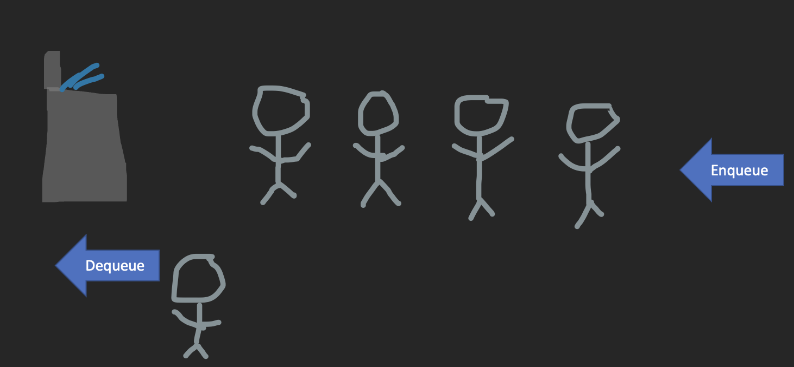

# Python Fundamentals Tutorial: **Queue**

## Table of Contents
[Welcome](0-welcome.md)

[Queue](1-queue.md)
* [Introduction](#introduction)
* [Water Fountain Queue](#water-fountain-queue)
* [Python Syntax for Queues](#python-syntax-for-queues)
* [Example](#example)
* [Problem to Solve](#problem-to-solve)

### Introduction
A <span style="color:yellow">queue</span> is nothing more than a Python list that is implemented in a certain way. With queues, we will want to follow a certain way of adding data and removing data, which in this case, the method is often referred to as "First In, First Out" or <span style="color:yellow">FIFO </span>for short.

### Water Fountain Queue
Imagine for one second, you are back in elementary school and are waiting in line to get a drink of water. The person drinking the water will be at the <span style="color:yellow">front</span> while the person that just joined the line to get a drink will be in the <span style="color:yellow">back</span>. Now, once the person in the front is done drinking his water or the next person kicks him off the fountain, he is <span style="color:yellow">dequeued</span> meaning that he has gotten what he has needed and now has left the queue. Imagine now, since the line has gotten shorted since the first person just left, that you want to join the queue of people waiting to get a sip of water. You get to the <span style="color:yellow">back</span> of the line and you are then <span style="color:yellow">enqueued</span> which means you are added to the back of the queue to wait your turn.



When we implement this structure into Python, we use the same principles. If we want to add something, we will add it to the back of the queue, thus <span style="color:yellow">enqueing</span> the value into the queue. Vice versa, if we wanted to remove something from the queue or <span style="color:yellow">dequeue</span> something, we will remove that from the front of the queue.

### Python Syntax for Queues
As mentioned in the [introduction](), we will be using a list to represent the queue data strucutre. There will be four main operations will we use to get the necessary results. First, we will need an <span style ="color:yellow">enqueue</span> operation to add a value to the queue in question. Next, we will need a <span style ="color:yellow">dequeue </span>operation to take off or get rid of a certain value from the queue. Another common operation we will want to have is to know how big the queue is, or you could say the <span style ="color:yellow">size</span>, and we can find that using Python's built-in function len. Likewise, we might need to see if the queue is <span style ="color:yellow">empty</span>, and we can do that by using the len function and seeing if the queue equals 0.

**Queue Primary Functions** | **Python Syntax**
--------------------------- | ----------------------
Enqueue                     |  ``` queue.append(new_value) ```
Dequeue                     |  ``` r_value = queue.pop(0)``` OR ``` r_value = queue[0]              del queue[0]```
Size                        |  ```q_length = len(queue) ```
Empty                       |  ``` if len(queue) == 0: ```

Python also has a queue library that can be imported by doing the following:
```
import queue
```
There are various commands that you can research, and try/test in the example and problem below from the library mentioned above. You can find the module and the commands at this [link](https://docs.python.org/3/library/queue.html). Note that this queue libray is not needed, and you could write your own class and functions to do all the necessities of the queue data structure.


### Example
For the example in this module, we will be making a class that holds all of the primary functions listed above. Those are a <span style ="color:yellow">enqueue</span> function, a <span style ="color:yellow">dequeue</span> function, a <span style ="color:yellow">size</span> function, and a <span style ="color:yellow">empty</span> function. Those functions written out in a class are as follows:
```python
class Queue:
    ''' Creation of the Queue class that will hold all of the functions needed to perform the needs of the data structure '''
    def __init__(self):
        ''' Intializing of the Queue in the form of a list '''
        self.queue = []

    def enqueue(self, value):
        ''' Sets up the enqueue function to add a value to the back of the queue '''
        self.queue.append(value)

    def dequeue(self):
        ''' Performs the dequeue functionality, being that it removes the first 
            value of the queue'''
        if self.empty():
            print('Nothing to dequeue!')
        else:
            value = self.queue[0]
            del self.queue[0]
            return value

    def size(self):
        ''' Checks to see the size of the queue '''
        return print(len(self.queue))

    def empty(self):
        ''' Checks to see if the queue is empty '''
        if len(self.queue) == 0:
            return True
        else:
            return False

```
Now, these are faily simple functions that perform very easy cases, and I have developed three test cases to make sure that everything with our class here is in tip top shape.

Our first test case is listed below:
```python
# Test Case 1: Enqueue and dequeue the same value
# Expected Result: 20
print()
print("TEST CASE I")
print("------------------")
test_queue = Queue()
test_queue.enqueue(20)
test_value = test_queue.dequeue()
print(test_value)
```
The outcome is exactly what we expected. When we enqueue the number 20, we put it to the back of the list by using Python's append function. When we dequeue it, since it is the only number in the queue, it will get returned as the test_value.

What if we had a ton of numbers in the queue and kind of lose track of how big it is? Well, the next test case covers this question, let's take a look.
```python
# Test Case 2: Add multiple in the queue, dequeue some, and check size throuhgout
#Expected Result: 6, 3, 0
print()
print("TEST CASE II")
print("------------------")
test_queue.enqueue(5)
test_queue.enqueue(10)
test_queue.enqueue(23)
test_queue.enqueue(45)
test_queue.enqueue(54)
test_queue.enqueue(63)
test_queue.size() 
test_queue.dequeue()
test_queue.dequeue()
test_queue.dequeue()
test_queue.size()
test_queue.dequeue()
test_queue.dequeue()
test_queue.dequeue()
test_queue.size()
```
With this test case, everything is returned the way we want and we are happy. We added a bunch of values to our queue and then found the size of it, that number being six. After that we tested the dequeue function again by removing three of the numbers, and then see the size again. Finally, we remove the last three numbers in the queue to be left at a queue size of 0.

We have almost tested all of the functionality of our class. The only thing we need to test now is the empty function and see if it works or not. The only time an empty queue is bad is when we try to dequeue something that isn't there. This test case will go over this scenario in more detail.
```python
# Test Case 3: Try to dequeue when there is nothing in the queue
# Expected Result: Throw an error message per there being nothing to remove
print()
print("TEST CASE III")
print("------------------")
test_queue.dequeue()
print()
```

If you remember, in the last test case, we removed all the numbers in the queue, leaving it empty. If we try to remove a value that isn't there, our program will throw a litter error message saying that there is nothing to dequeue.

A link to the example file can be found [here](python_files/01-queue_example.py).
### Problem to Solve
#### Instructions
This assignment is to be completed individually to make sure you fully understand the concepts taught in this module. 

Download the <a href="python_files/01-queue_problem.py" download="01-queue_problem.py">01-queue_problem.py</a> problem file and do your best to solve the problems with the test cases.

There will be three problems with the file, and each of the test cases provided will give you better insight on what those problems are.

After you are finished finding all the problems, compare your answers to the <a href="python_files/01-queue_problem_answer.py" download="01-queue_problem_answer.py">answer sheet</a> and see where and what you can improve on.