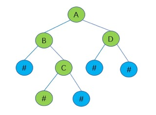
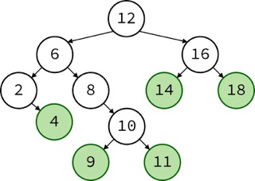
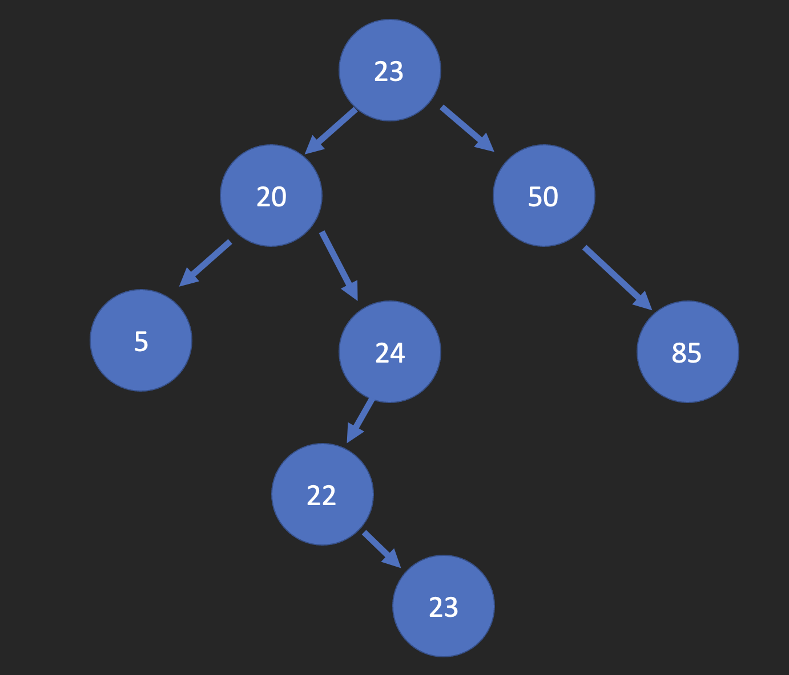
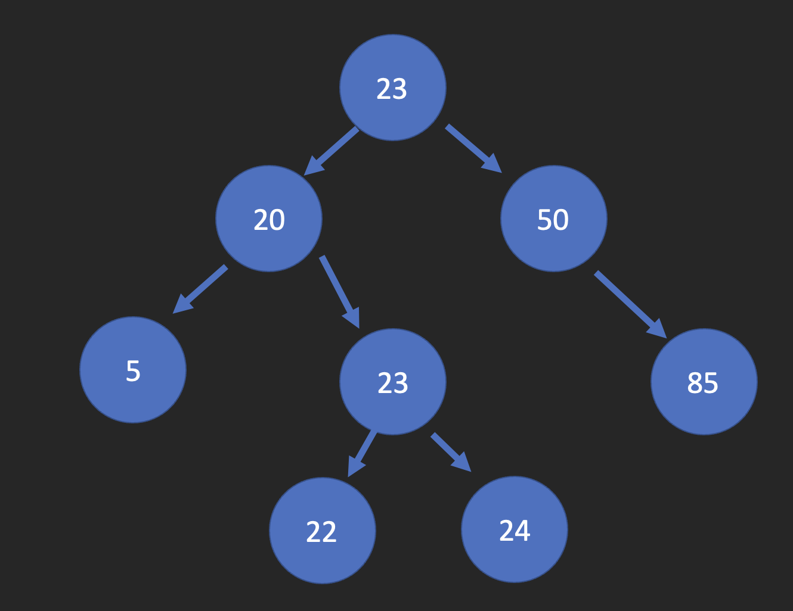

# Python Fundamentals Tutorial: **Tree**

## Table of Contents
[Welcome](0-welcome.md)

[Tree](3-tree.md)
* [Introduction](#introduction)
* [Different Kinds of Trees](#different-kinds-of-trees)
    - [Binary Tree](#binary-tree)
    - [Binary Search Tree](#binary-search-tree)
    - [Balanced Binary Search Tree](#balanced-binary-search-tree)
* [Primary Functions for Trees](#primary-functions-for-trees)
* [Example](#example)
    - [Tree Operations](#tree-operations)
        - [Inserting into a BST](#inserting-into-a-bst)
        - [Checking to see if data is in BST](#checking-to-see-if-data-is-in-bst)
        - [Traversing a BST](#traversing-a-bst)
        - [Finding the Height of a BST](#finding-the-height-of-a-bst)
* [Problem to Solve](#problem-to-solve)

### Introduction
A <span style="color:yellow">tree</span>, in a programming sense, is a data structure that mimics linked list functionality because it connects nodes, or in other words data stored within the list, to eachother. The thing that makes <span style="color:yellow">trees</span> different is that they can connect to multiple nodes and have various ways of doing that, which we will go over shortly.

### Different Kinds of Trees
There are three main trees we will talk about and use throughout this module. Those trees are <span style="color:yellow">a Binary Tree</span>, <span style="color:yellow">a Binary Search Tree</span>, and <span style="color:yellow">a Balanced Binaray Search Tree</span>. We will go over each and talk about how they are used, what makes each unique, and so forth.
#### Binary Tree
<span style="color:yellow">A Binary Tree</span> is a tree that links to only two other nodes. Now, you may think this sounds like a linked list because linked list also link to just two nodes, but let's look at an example of  <span style="color:yellow">a Binary Tree</span> and you will see the difference



As we can see in this picture, only the <span style="color:yellow">root</span> node links to two other nodes, which is depicted as the letter A. B and D in the picture are often refered to as the <span style="color:yellow">parent</span> nodes per there being another node connected under it in the tree. That node connected under it, characterized by the letter C, is often referred to as the <span style="color:yellow">child</span> node. Also, at the very bottom of the trees where all of the hashtags or pound signs, depending on what era you grew up in, are called <span style="color:yellow">leaf</span> nodes because there are no nodes to connect to below them. Also, any <span style="color:yellow">parent</span> node can become a <span style="color:yellow">root</span> node to what we like to call a <span style="color:yellow">subtree</span>. 

Something that makes <span style="color:yellow">Binary Trees</span> similar to linked lists is that you can traverse the tree up and down because all the nodes point back to the top node.
#### Binary Search Tree
To explain it very breifly, a <span style="color:yellow">Binary Search Tree</span> is a <span style="color:yellow">a Binary Tree</span> that follows certain rules. Those certain rules are the nodes are placed in the tree in accordance with the <span style="color:yellow">root </span>node and <span style="color:yellow">parent </span> node. Let's see another visual example to help us understand what is being said and explained.



How <span style="color:yellow">Binary Search Trees </span> work is that there is a main <span style="color:yellow">root</span> node that everything is compared to. In the case of the picture, 12 is the <span style="color:yellow">root</span> node. Then, the next node would be compared to 12 and if it was smaller than 12, it would be put on the left side of the <span style="color:yellow">root</span>, and vice versa, if the node was bigger than 12, it would be placed on the right side. Then, when a new node was to be inserted into the <span style="color:yellow">BST</span>, it would then be compared to the <span style="color:yellow">root</span> and the <span style="color:yellow">parent</span> nodes on either side, depending if it was bigger or smaller than the <span style="color:yellow">root</span> node.

Now, for example, if we wanted to add the number 7 in the mix. We would first go to the <span style="color:yellow">root</span> node and see that it was smaller than the <span style="color:yellow">root</span> 12, so then we would go to the left side of the tree to the <span style="color:yellow">parent</span> node 6. From there we would see that the number 7 is bigger than the <span style="color:yellow">parent</span> 6, so then we would go to the right of the <span style="color:yellow">parent</span> node. Now, we see that 7 is less than the <span style="color:yellow">child</span> 8, so we would then place 7 as the <span style="color:yellow">leaf</span> of the <span style="color:yellow">child</span> 8, and that is how data is inserted into <span style="color:yellow">BST</span>.

#### Balanced Binary Search Tree
Now, a <span style="color:yellow">Balanced Binary Search Tree</span> is a <span style="color:yellow">BST</span> that's height isn't too different on both sides. There have been many algorithims to test what "too different" is, but one of the main algorithims that is used is call the <span style="color:yellow">Adelson-Velskii and Landis tree</span>, which we will abreviate to an <span style="color:yellow">AVL Tree</span>. With this algorithim, it is stated that the difference between the heights of each subtree must be less than 2. Let's look at another example of a BST and see if it is balanced or not.



As we can see with this example, this tree is considered inbalanced because on the left side, the heights of the <span style="color:yellow">subtrees</span> are 2 from node 20 and 4 from node 20. What we have to do to rebalance the BST is what we call a <span style="color:yellow">node rotation</span>. To do this, we are going to switch the <span style="color:yellow">leaf</span> node 23 with the <span style="color:yellow">child</span> node 24, and the tree will then look like this.



This is considered balanced because each of the <span style="color:yellow">subtrees'</span> heights are now less than 2 with the heights being 2, 3, 3, and 2.

### Primary Functions for Trees
Since there is not a built-in function for <span style="color:yellow">BST's</span> in Python, we will be making our own this week with the example. For our syntax, we will be going over the various functions we will have in the class and what they do.

**Tree Primary Functions**  | **Description**
--------------------------- | ----------------------
Insert                      | Checks the logic of a BST and inserts the node where it should
Remove                      | Removes the node from where it was in the BST
Traverse                    | Can traverse up and down the BST, which means you can view the items smallest to largest or vice versa.
Height(node)                | Checks the height of a certain node.
Member(value)               | Checks to see if the value is wihin the BST.
Size                        | Shows the size of the BST.
Empty                       | Checks to see if the BST is empty.

### Example
For our example today, we will be going over some <span style="color:yellow">BST</span> operations that were mentioned previously as primary functions.

#### Tree Operations
The <span style="color:yellow">BST</span> operations we will be going over will be inserting, checking to see if data is in, traversing, and finding the height of a <span style="color:yellow">BST</span>.

##### Inserting into a BST
Inserting into a <span style="color:yellow">BST</span> works by checking to see if the <span style="color:yellow">BST</span> already has a <span style="color:yellow">root</span> node. If it doesn't, the data we are trying to insert will become the <span style="color:yellow">root</span> node. If there already is a root node, it will use <span style="color:yellow">BST</span> logic spoken of previously to find the correct spot and add the data node where it needs to be. Some code to show this process is provided below.

```python
def insert(self, data):
        """
        Insets a node and its data in its right spot on the BST. 
        Checks to see if there is a root and if there is not, it 
        will make the data inputted the new root node. If there 
        already is a root, it will go through the list and see 
        where the data node belongs.
        """
        if self.root is None:
            self.root = BST.Node(data)
        else:
            self.real_insert(data, self.root)

    def real_insert(self, data, node):
        """
        Where the real magic happens. This function receives the 
        current subtree from the other insert function, and uses the 
        logic of a BST to place the data wherever it needs to go.
        """
        # No duplicates, if duplicate detected, recursion is terminated
        if data == node.data:
            return
        if data < node.data:
             # The data belongs on the left side.
            if node.left is None:
                # We found an empty spot
                node.left = BST.Node(data)
            else:
                # Need to keep looking.  Call real_insert
                # recursively on the left sub-tree.
                self.real_insert(data, node.left)
        else:
            # The data belongs on the right side.
            if node.right is None:
                # We found an empty spot
                node.right = BST.Node(data)
            else:
                # Need to keep looking.  Call real_insert
                # recursively on the right sub-tree.
                self.real_insert(data, node.right)
```
As you can see, we also account for duplicate nodes because we wouldn't want the same node in our <span style="color:yellow">BST</span>. We wouldn't want that because the logic would then become messed up with trying to figure out whether it was smaller or bigger.

Also, to continue over the <span style="color:yellow">subtrees</span>, we use recursion to continue to narrow the results down until we find the correct place to put our new data node.

##### Checking to see if data is in BST
We can also check to see if a certian data node is contained in a given <span style="color:yellow">BST</span>. We can do this by using some code that looks like this.

```python
def member(self, data):
        """
        Checks to see if the value you are looking for is a member of the BST.
        """
        return self.real_member(data, self.root)

    def real_member(self, data, node):
        """
        Where the real magic begins. This function will go throuhgout the 
        entire BST looking for the data variable. Again, the subtree being 
        used is represented by node.
        """

         # If number is found, return true
        if data == node.data:
            return True
        if data < node.data:
            # The data belongs on the left side.
            if node.left is None:
                # We found an empty spot, return false
                return False
            else:
                # Need to keep looking.  Returns 
                # the function recursively with new node
                return self.real_member(data, node.left)
        else:
            # The data belongs on the right side.
            if node.right is None:
                # We found an empty spot, return false
                return False
            else:
                # Need to keep looking.  Returns 
                # the function recursively with new node
                return self.real_member(data, node.right)
```
We traverse the whole tree to look for the data in question. We first start on the left side, and continue from smallest to largest. If the data is found, True is returned. If it is not, False is returned.

This operation also uses recursion to continue to search through the tree until the data is found.
##### Traversing a BST
There are two ways you can traverse a <span style="color:yellow">BST</span>. You can traverse down and up, depending on what way you want the numbers to be. You could also refer to traversing as forward and backward, but up and down pays homeage to the tree analogy, so we sprung for that way in the code below.

```python
 def traverse_down(self):
        """
        Also known as traversing forward, it starts at the root node and goes 
        to the left subtree to find the smallest value, and 'yields' that value 
        for it to be printed out to the user. It will continue to do this until 
        all of the nodes, smallest to largest have been 'yieled' to be printed out.
        """
        yield from self.real_traverse_down(self.root)

    def real_traverse_down(self, node):
        """
        Where the magic begins. If the current subtree is not none, it will yield the 
        smallest value, and will continue to yield smallest to largest until it has gone 
        through all the nodes.
        """
        if node is not None:
            yield from self.real_traverse_down(node.left)
            yield node.data
            yield from self.real_traverse_down(node.right)
```
Shown above is the traverse down, or as it is also known as traversing forward, which finds all the numbers from smallest to largest, and, with using the 'yield', makes it able to display all the numbers in that order back to the user.

To do is the other way, which is to traverse up or to traverse backward, you would just reverse the order in real_traverse_down to make node.right go first instead of node.left.

##### Finding the Height of a BST
Finding the height of a <span style="color:yellow">BST</span> is pretty straightforward. All you have to do is count both sides of the tree from the root, and see which side is biggest, and the biggest number is how big the <span style="color:yellow">BST</span> is. Some code for our visual learners is provided below.

```python
def height(self):
        """
        Determines the height at a given node. Checks to see if there is a root and if 
        there is not, the height is returned to be 0 per the BST being empty. If there is
        a root, the get_height function is called with the root passed into it.
        """
        if self.root is None:
            return 0
        else:
            return self.get_height(self.root)  

    def get_height(self, node):
        """
        Where the magic happens. Checks to see if the current node is none, and if it is,
        the height is returned as 0. Otherwise, the function goes through and traverses 
        the tree, adding up both sides of the current tree to see which side is bigger.
        Whichever side is bigger is returned and is deemed the height of the tree.
        """
        # Base Case
        if node is None:
            return 0

        # Check to see the height
        else:
            # Function calls for each side of the tree
            height_left = self.get_height(node.left)
            height_right = self.get_height(node.right)

            # Adds one if the left side is bigger to account for node that
            # we are currently on.
            if height_left > height_right:
                return height_left + 1

            # Adds one if the right side is bigger to account for node that
            # we are currently on.
            else:
                return height_right + 1
```
As said above, these two functions will go through each <span style="color:yellow">subtree</span> and find the heights, and will return the biggest height.

If you want to see the entire class the code above comes from, click [here](python_files/03-tree_example.py).
### Problem to Solve
This assignment is to be completed individually to make sure you fully understand the concepts taught in this module. 

Download the <a href="python_files/03-tree_problem.py" download="03-tree_problem.py">03-tree_problem.py</a> problem file and do your best to solve the problems with the test cases.

There will be three problems with the file, and each of the test cases provided will give you better insight on what those problems are.

After you are finished finding all the problems, compare your answers to the <a href="python_files/03-tree_problem_answer.py">answer sheet</a> and see where and what you can improve on.